# Activité Pratique N°3 — Spring MVC avec Thymeleaf

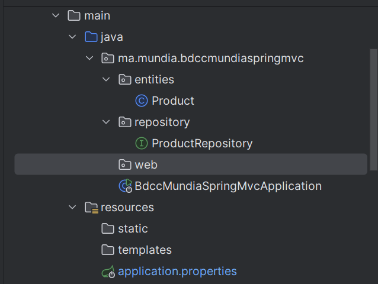

# Créer l'entité JPA Product
La classe Product avec les annotations Lambok:
- @Builder pour la construction des objets,
- @Entity pour qu il soit une entite JPA,
- @GeneratedValue pour un auto increment,
- @NotEmpty et @Size des annotations de validation.
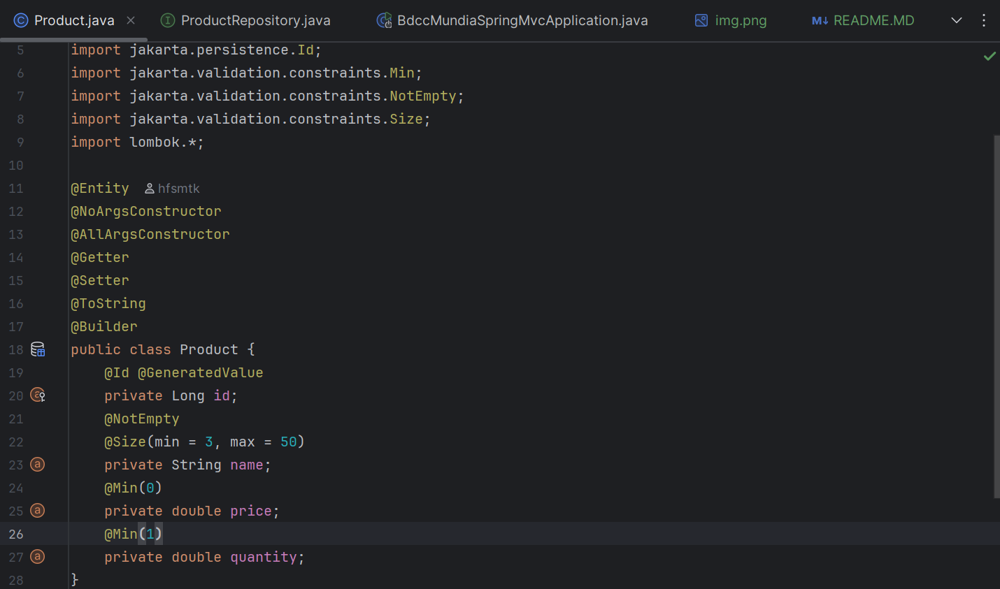

# Créer l'interface ProductRepository basée sur Spring Data
Pour travailler avec Sping Data il faut que l'interface herite de JpaRepository
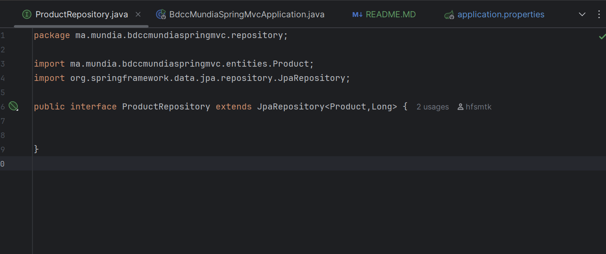

# Tester la couche DAO
@Bean et commandLineRunner pour nous permettre d'executer des traitemant au demarage
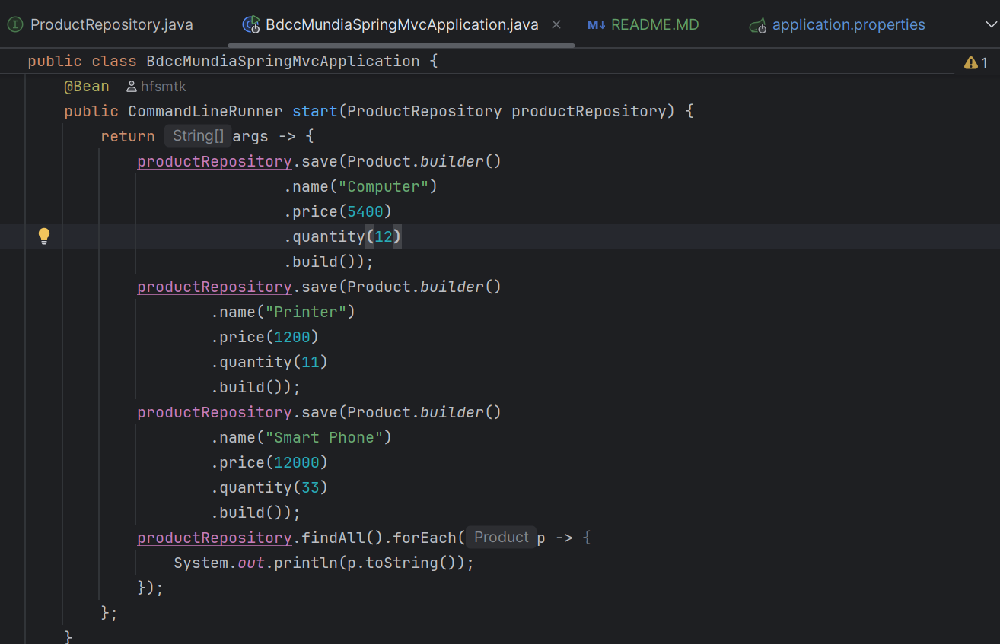
on va prendre le mdp afficher pour acceder a h2-console
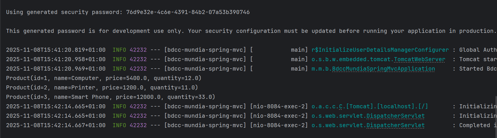
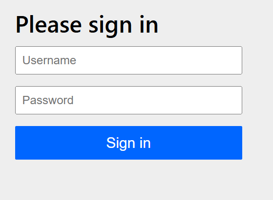
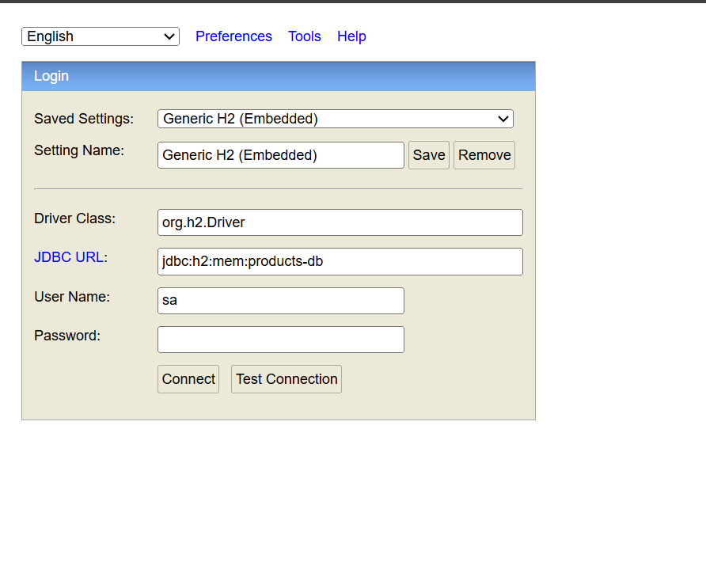

# Désactiver la protection par défaut de spring security
on ajoute exclude = {SecurityAutoConfiguration.class} pour desactiver spring security alors on va acceder directement a h2-console sans mdp

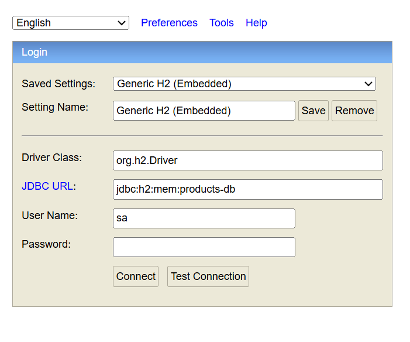

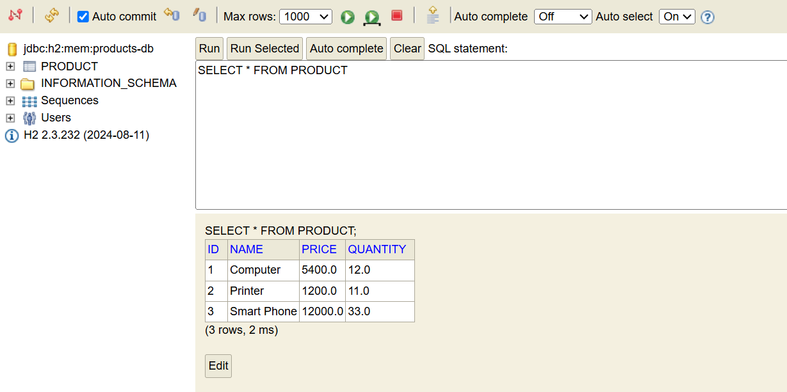

# Créer le contrôleur spring MVC et les vues thymeleaf pour :
- Afficher la liste des produits :
  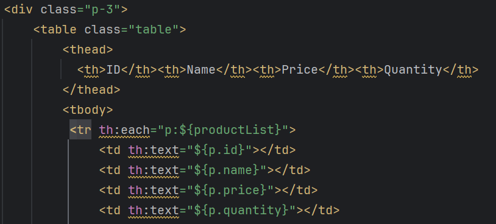
Affichage:
  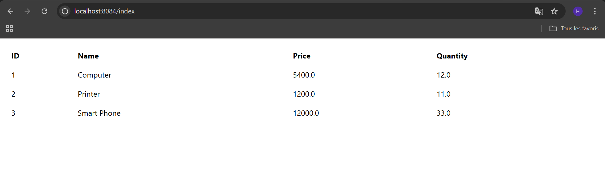

- Supprimer un produit :
    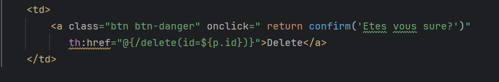
Affichage:
    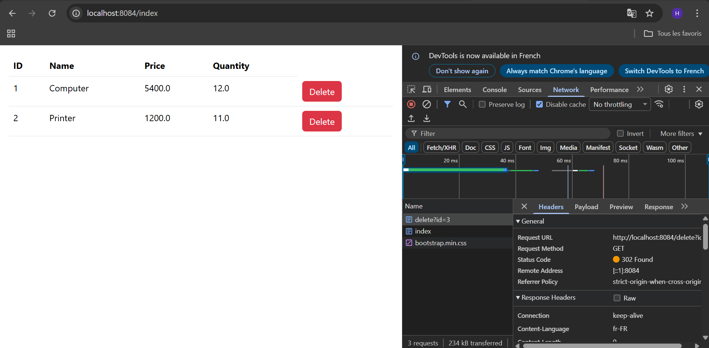

    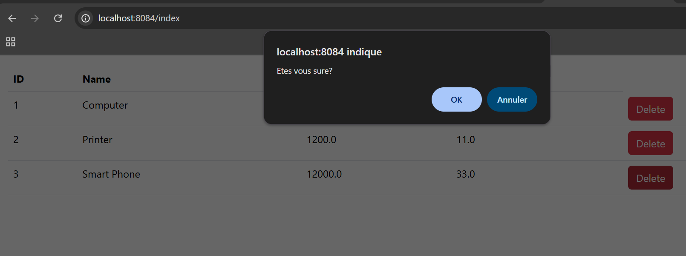

- Page template basée sur Thymeleaf layout et bootstrap :

   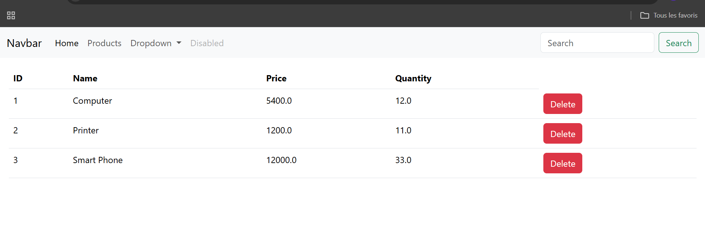
  

- Saisir et ajouter un produit avec la validation du formulaire :
@Valid automatiquement quand il va spring mvc stocker les donnees saisi dans product il va verifier
est ce que les attributs respectent les contraintes et s'il y a des erreurs les listes d'erreurs vont etre 
stocker dans BindingResult

    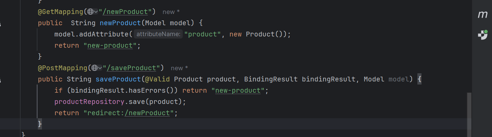

Affichage:
     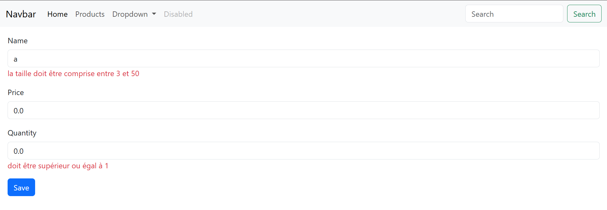
     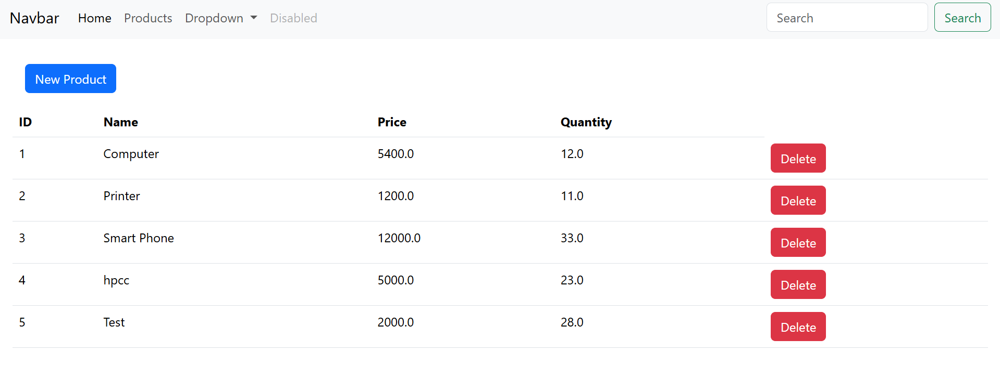
les produits HPC et Test on ete ajouter 

# Sécuriser l'application avec Spring Security

 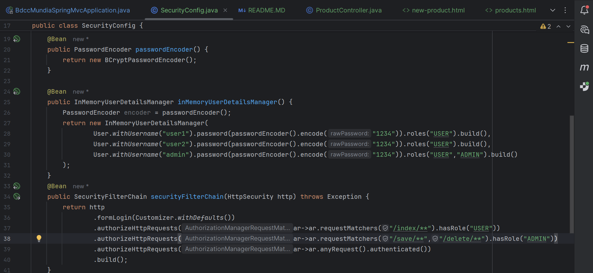

Affichage :
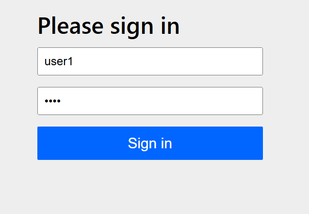
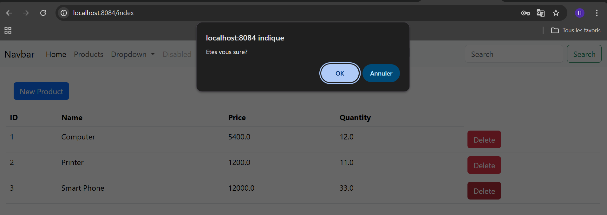
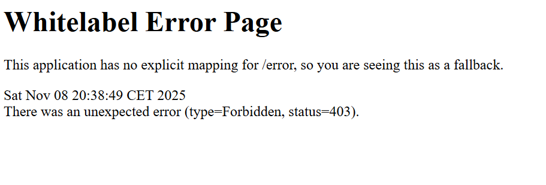
erreur 403 c a d non autorise,
 il n a pas laisser user1 supprimer un produit car il n est pas autorise selon le code de security

